# Отчет по Лабораторной работе №6
## Тема: «Комплексное улучшение UX (User Experience) информационной системы»

**Студенты:** Василюк Матвей, Линкевич Кирилл, Чехович Дмитрий  
**Проект:** Система бронирования билетов «CinemaPro»  
**URL:** [https://cinemapro.shop](https://cinemapro.shop) (GCP, HTTPS)

---

### 1. Оценка ПО по атрибутам качества (ISO/IEC 25010:2011)

Согласно международному стандарту SQuaRE, удобство использования (Usability) оценивается по шести ключевым атрибутам. Оценка системы после проведения улучшений:

1.  **Распознаваемость соответствия (Appropriateness Recognizability):**
    *   **Оценка:** Высокая. Благодаря внедрению динамического окрашивания рейтинга (зеленый/желтый/красный), пользователь за доли секунды распознает качество фильма. Иконки соответствуют общепринятым стандартам (Google/Apple Usability).
2.  **Обучаемость (Learnability):**
    *   **Оценка:** Высокая. Весь процесс (от выбора фильма до получения билета на почту) интуитивно понятен. Формы входа и регистрации не содержат лишних полей.
3.  **Используемость (Операбельность) (Operability):**
    *   **Оценка:** Высокая. Приложение адаптировано под мобильные устройства (адаптивные карточки вместо громоздких таблиц).
4.  **Защита от ошибок пользователя (User Error Protection):**
    *   **Оценка:** Высокая. Внедрена активная валидация. Места, которые уже заняты другими пользователями, блокируются для выбора, исключая коллизии.
5.  **Эстетика GUI (User Interface Aesthetics):**
    *   **Оценка:** Высокая. Реализован полный переход на кастомную темную тему. Интерфейсы авторизации теперь визуально неотделимы от основного приложения.
6.  **Доступность (Accessibility):**
    *   **Оценка:** Высокая. Соответствие стандарту **WCAG 2.0**. Улучшена контрастность сетки мест (свободные/занятые). Реализован доступ по HTTPS.

---

### 2. Улучшение UX по уровням «Опыта использования»

Мы проанализировали продукт по 5-уровневой модели:

*   **Уровень стратегии (Strategy):** Обеспечение безопасности и глобальной доступности. Реализован деплой на **GCP** с SSL-сертификатом.
*   **Уровень набора возможностей (Scope):** Расширение функционала самообслуживания через интеграцию с **Mailtrap** (верификация и восстановление доступа).
*   **Уровень структуры (Structure):** Полная переработка логики **Onboarding**. Вместо стандартных экранов Keycloak, нарушавших навигацию, внедрена бесшовная структура авторизации.
*   **Уровень компоновки (Skeleton):** Оптимизирована схема зала. Улучшено расположение номеров рядов и кресел для исключения ошибок при выборе.
*   **Уровень поверхности (Surface):** Внедрена динамическая индикация рейтингов и исправлено отображение валюты на корректное «р.».

---

### 3. Рефакторинг авторизации (Вход, Регистрация, Восстановление)

Одной из главных задач было устранение антипаттерна «Разрыв контекста».

*   **Проблема (До):** Стандартный интерфейс Keycloak выглядел как сторонний ресурс, пугая пользователей белым фоном и чуждым дизайном. Это критически снижало доверие на этапе Onboarding.
*   **Решение (После):** Мы полностью переписали визуальную часть (Theme) Keycloak. Теперь формы входа, регистрации и восстановления пароля используют те же CSS-переменные, шрифты и стили кнопок, что и основное приложение.
*   **UX-эффект:** Пользователь чувствует себя в безопасности, оставаясь в едином визуальном пространстве бренда.

**Визуальное сравнение:**

| До | После |
|-----------|--------------|
| Вход: 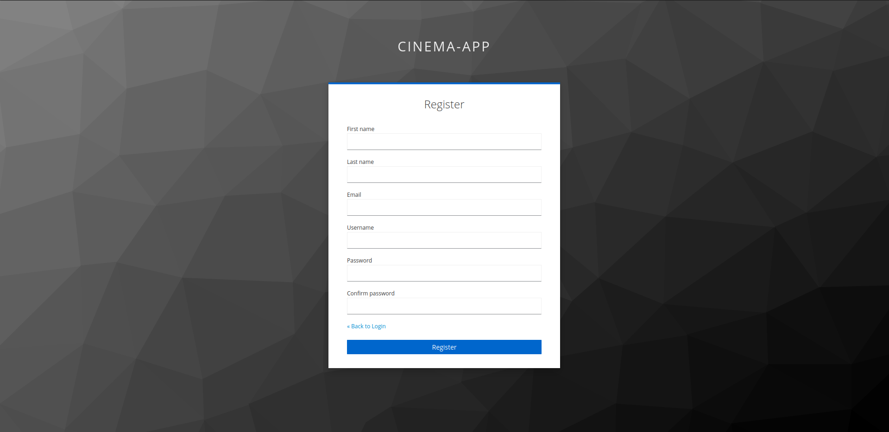 | Вход: 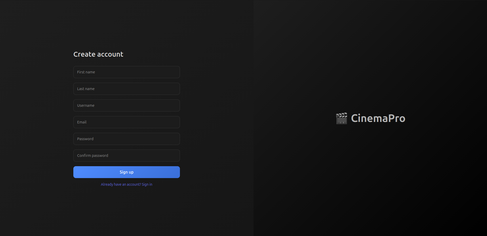 |
| Регистрация: 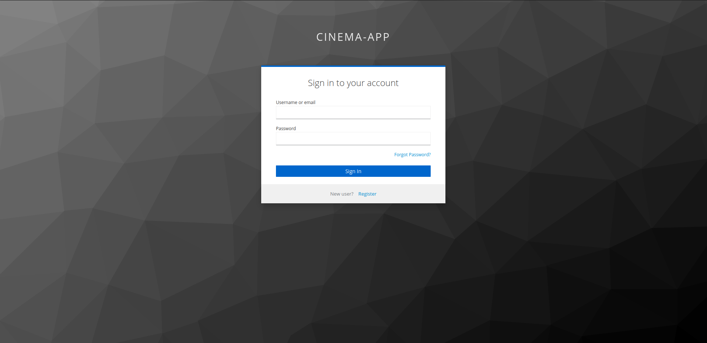 | Регистрация: 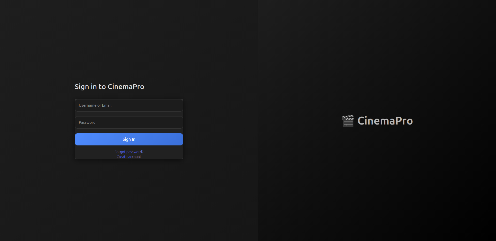 |
| Восстановление: 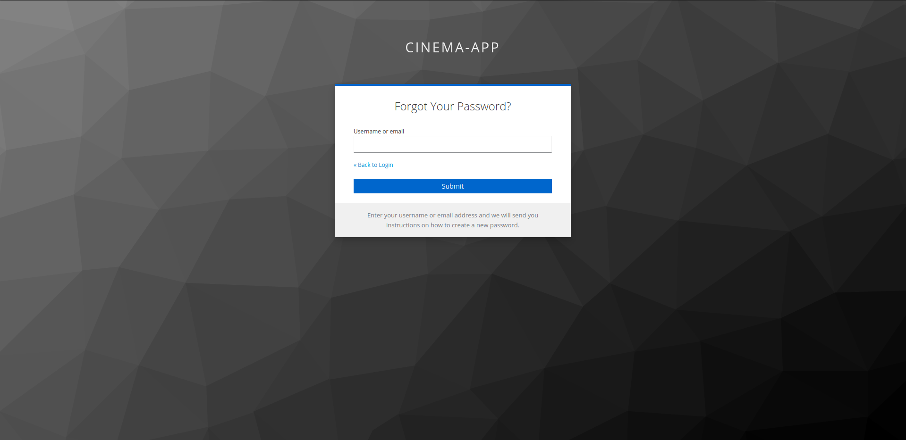 | Восстановление: 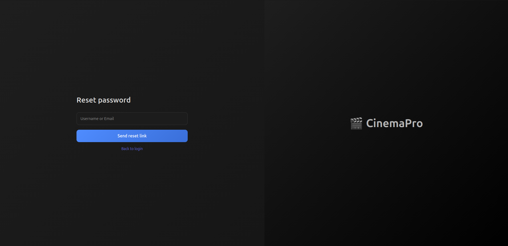 |

---

### 4. Проектирование и валидация форм

1.  **Валидация:** Формы регистрации теперь проверяют сложность пароля и корректность email «на лету», предотвращая отправку неверных данных на сервер.
2.  **Платежи и валюта:** В соответствии с требованиями локализации, отображение цены было исправлено. Теперь стоимость билетов четко обозначается как **«300 р.»**, что привычно для целевой аудитории.
3.  **Окно выбора мест:** Проведен аудит контрастности. Цвета свободных и занятых мест разнесены по шкале яркости, чтобы пользователи с особенностями цветовосприятия могли легко их различить.

---

### 5. Сравнение «До» и «После» (Визуальный аудит)

#### 5.1. Интерфейс входа и регистрации (Onboarding)
*   **До:** Стандартная белая страница Keycloak.
*   **После:** Кастомный темный UI CinemaPro.

| Экран | Было | Сейчас |
|-------|-------------|----------------|
| Вход |  |  |
| Регистрация |  |  |

#### 5.2. Система рейтингов (Визуальная иерархия)
*   **До:** Монотонные желтые звезды для всех фильмов.
*   **После:** Цветовая индикация (Зеленый/Желтый/Красный).

#### 5.3. Схема зала и валюта (Используемость)
*   **До:** Низкий контраст мест, отсутствие обозначения валюты «р.».
*   **После:** Высококонтрастная схема, четкое «р.» рядом с ценой.

| Экран | Было | Сейчас |
|-------|-------------|----------------|
| Главный экран | 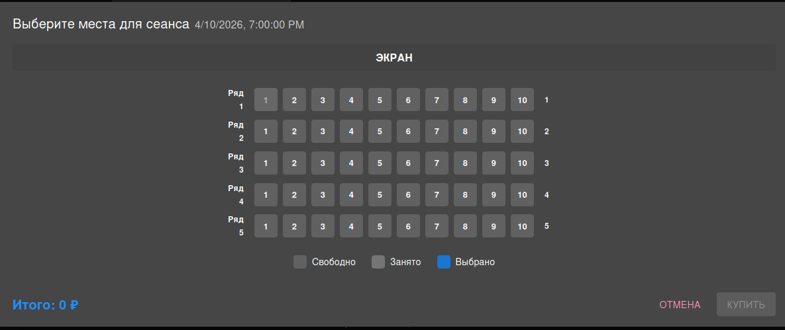 | 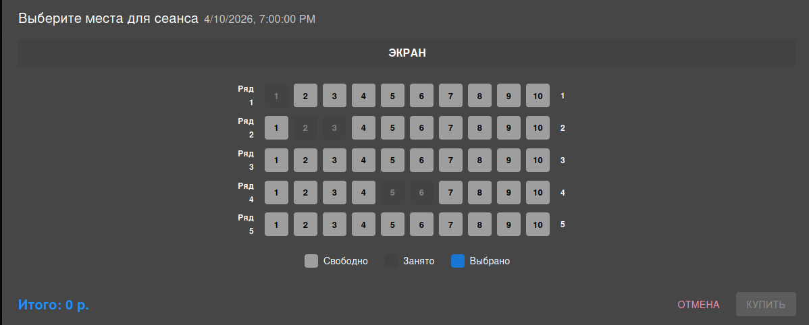 |
| Мои билеты | 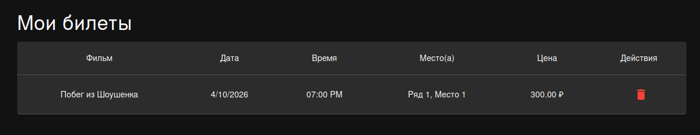 | 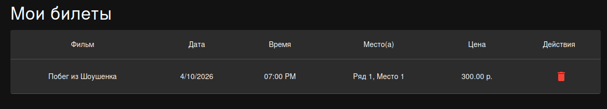 |
| Избранное | — | 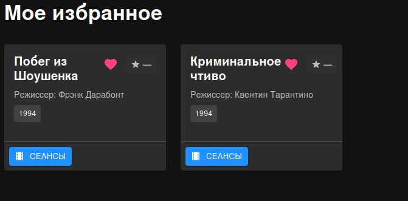 |

#### 5.4. Восстановление пароля и почта
*   **До:** Отсутствие возможности восстановить аккаунт.
*   **После:** Интерфейс восстановления и пример письма в Mailtrap.

| Экран | Было | Сейчас |
|-------|-------------|----------------|
| Восстановление |  |  |

---

### 6. Техническая реализация

**Фрагмент кода цветовой индикации:**
```typescript
const getRatingColor = (rating: number): string => {
    if (rating >= 8) return '#4caf50'; // Зеленый (Отлично)
    if (rating >= 5) return '#ffeb3b'; // Желтый (Средне)
    return '#f44336'; // Красный (Плохо)
};